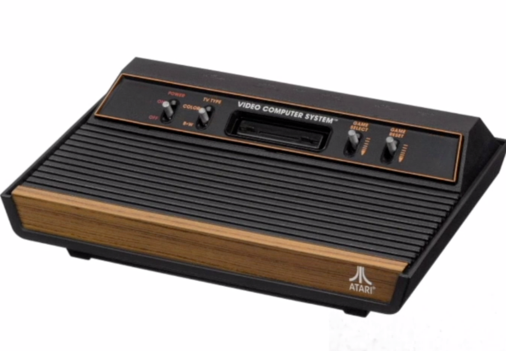
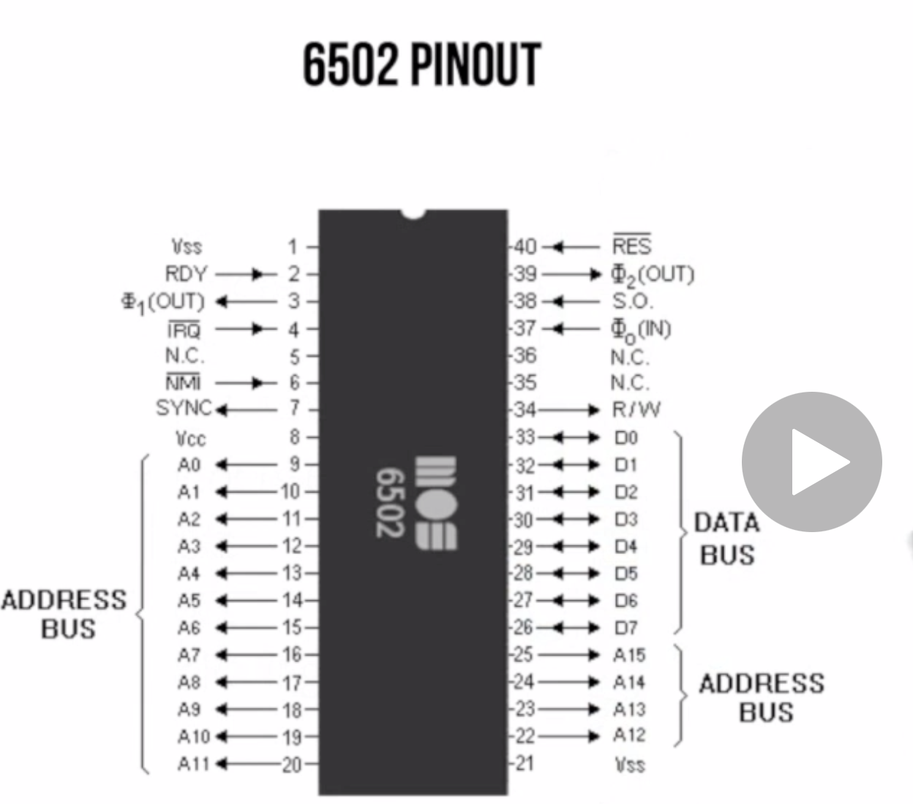

# Learn Assembly Language 6502 by Making Games for the Atari 2600

# 1. Introduction
## 1.1. Motivations and Learning Outcomes
### First Words
So this is it.

The genesis right.

Welcome to program games for that Harry.

Twenty six hundred.

Thanks for joining me.

My name is Gustavo petty.

I teach computer science mathematics here in London and I'm going to be a big structure for discourse

in the next couple of hours we're going to break the terrorism apart to bits and bytes understand all

the components and how things are being program for the Atari 600 guys.

I'm sorry to break it down to you but chances are that if you intro for a course that is called programming

games using assembly language.

You are my type of people.

You are in a safe zone.

There is no way out of it.

We're going to have fun.

Don't worry.

We're gonna start very slow.

If you have experience or even if you are a pro developer chances are you're going to learn something

new right.

Yes.

The authority 600 is a very minimal kind of small instruction set.

That is the beauty of it.

And that's what some people ask me like.

OK.

Gustavo you are a college professor right.

Why do you territory 600 shouldn't you be teaching all the kids kind of to be more productive.

Shouldn't you be teaching this whole new funky web framework web pack or maybe in the back end dysfunctional

programming technique that makes everyone kind of be more productive and make the big bucks.

Yes.

Right.

I.

That's the thing that I have to do.

It's like paying taxes.

This is what you have to do.

If you want to be a productive practitioner in software engineering yes you should go and we don't have

to do that.

But Gustavo why the territory's 600 Why did you pick specifically that territory 600 honestly I'm not

being naive here.

I'm not being naive or just my whole approach is not just nostalgia or the sake of gaming.

There is an opportunity by looking at something as small and that's minimal.

And with this small instruction set and there's no hardware architecture that is the interpreter 600

that it's almost like limiting ourselves taking a step back limiting ourselves in order to expand ourselves.

So in order to understand this monster architectures that we have today the processor memory the display

set the stack all these things.

Right.

If you have an iPhone a night my iPad these machines that can processor they have memory they have the

stack and they work with the display.

They work with pixels being activated and decorated being rendered on the screen.

So that is kind of my approach and the whole point is it's not just me being nerdy right but my student

several students come to me and say let's not go.

Last class you told us that we should be super excited about writing our first line of code.

And if you ever programmed before or if you ever Google something about programming chances are that

that is going to be something similar to what your first line of code.

But everyone tells it what it is.

Right.

So that is a high level language.

Yes.

You go and you compile your code your run and you'll see displayed Hello world on the screen and that

is Oh very nice.

I think we understand the appeal of using a high level language for testing things conditionals if Alice

loops functions Lane Domino program the higher level way like handling data that is all fine we understand

the hope you of that but several students they come to me and they can't just a computer science they

came to study understanding the ins and out right they say right Gustavo I understand but I want more.

There is something that is missing right.

I'm just saying print Hello World.

I have been printing hello world since I was a kid working with words star or Microsoft Word.

I want to understand there is this great box in front of me that has a processor that has these memory

because I know that because the guy RadioShack told me that there is this memory that I should spend

more money with.

How did this thieves communicate to each other.

What is going on under the hood.

When I say print Hello world what is going on under the hood in the memory in the processor that kind

of goes and displays h e l l o world I understand.

I wasn't very satisfied when I kind of just wrote this.

There is more.

That's that is my motivation as an educator as a professor to come and create a company like this one

and I know that as a student as someone that just enroll for this course you probably leave in this

kind of investigative approach right you are curious by nature and this is why I'm tackling this.

If I'm making you sweat in the next couple of hours don't worry.

Stick around I promise you by the end of this course you will learn quite a bit about computer architecture.

The low level programming as to say some but I just want to give you a bird's eye view of the plan that
___

### Content of the Course
* Atari 2600 Hardware & Specs
* The 6502/6507 Processor
* Working with Digital Values (bin/hex)
* Using an Atari Emulator
* Assembling your own ROM cartridges
* The basics of 6502 Assembly Language
* Video, Audio and Input adapters
* Code examples and techniques
___

### Other Points
* Assembly 6502 is closer to Human Programmin Languages (It was created for the Game Developers of Atari!) than Assembly x86 which nowadays is available.
___

# 2. Hardware and Architecture

## 2.1. Hardware and Specs
* The very first gaming devices (ca. 1972) had only one games and if you wanted a new game you should have bought a new device!

* The most old video games PONG, TANK had some common elements (Remember about these elements we will talk about them later and the communication between devices for them):
    * Player 1
    * Player 2
    * Scoreboard
    * Ball / Missile
    * Playing Field
    * Collision / Bouncing

* In 1975, Atari decided to release a console based on programmable design

* Code name of project was Stella

* 3 Processors were considered (candidated) for the Atari 2600:
    * Intel 8080
    
    * Motorola 6800
    
    * __MOS 6502__ (bought by Commodor before release) - The winner!
        * A lot cheaper (15$) than Intel8080 and Motorola6800 (around 120$)!

### ATARI 2600

* CPU : 1.19 MHz 6507

* Audio/Video : TIA Chip (Television Interface Adapter)

* RAM : 128 bytes 6532 RIOT (Read Input Output Timer) Chip

* ROM (game cartridges) : 4kB (So we have 4kB for writing our code in this course!)

* Input : Two controller ports (joystick, paddle, etc)

* Output: TV via RCA Connector : There were 3 Standards available (NTSC, PAL, SECAM). NTSC for America and the PAL is the european version

### Timeline of Atari 2600
* 1977 - 2600 "HEAVY SIXER" 

* 1978 - 2600 "LIGHT SIXER"

* 1980 - 2600-A "FOUR-SWITCH"

* 1981 - 2600 "DARTH VADER"

* 1986 - 2600 JR

### Board

### Processor
* The __6502__ powered ...
    * Apple lle
    * Commodore PET
    * BBC Micro
    * Commodore VIC-20
    * Commodore 64
    * Tamagotchi
    * Atari 2600
    * Bender Rodrigues

### 6507 Processor
* 6507 is essentially a 6502 in a cheaper 28-pin package.
* A15 to A13 and other interruption lines are not accessible (to make it cheaper)

### TIA PAL and NTSC

___

## 2.2. Review of Binary and Hexadecimal
## 2.3. The 6502 Processor
## 2.4. Carry and Overflow Flags