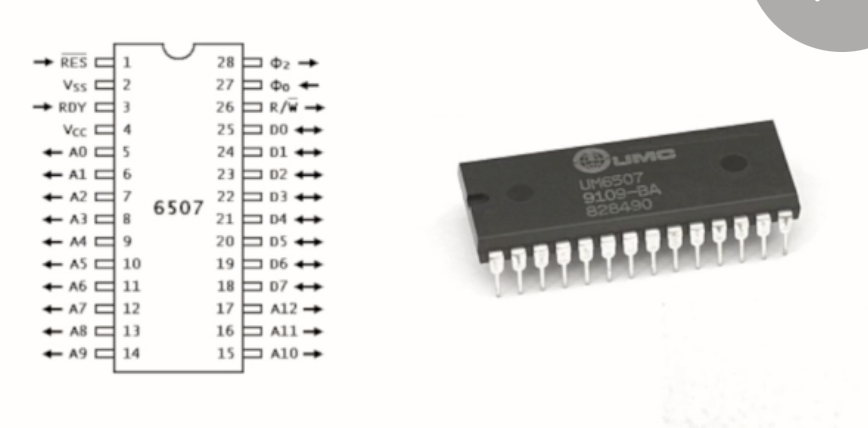
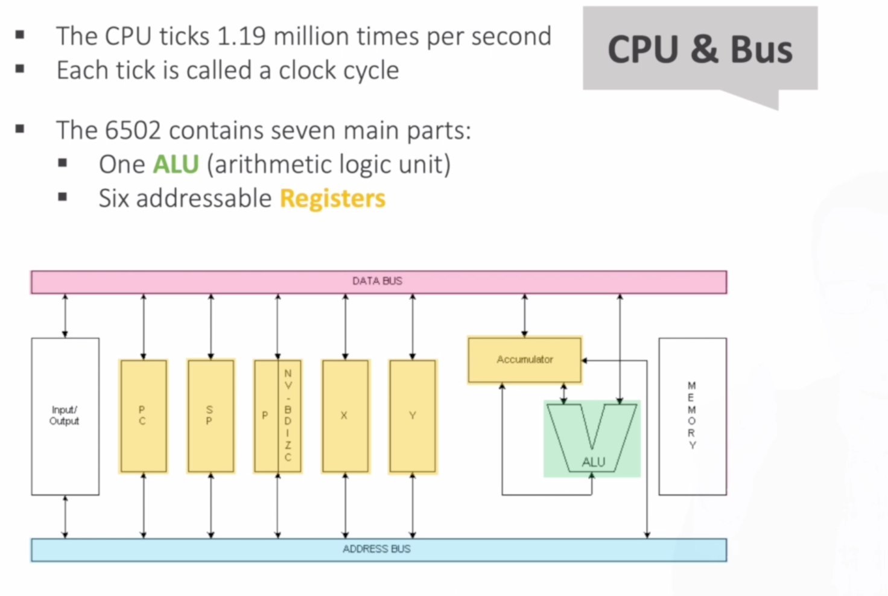
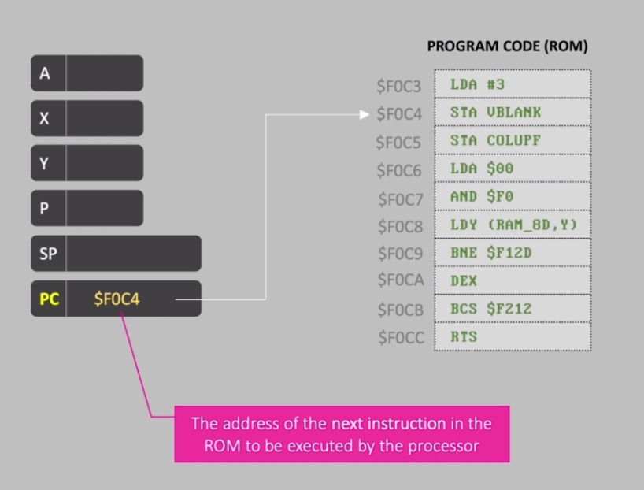

# Learn Assembly Language 6502 by Making Games for the Atari 2600

# 1. Introduction
## 1.1. Motivations and Learning Outcomes
### First Words
So this is it.

The genesis right.

Welcome to program games for that Harry.

Twenty six hundred.

Thanks for joining me.

My name is Gustavo petty.

I teach computer science mathematics here in London and I'm going to be a big structure for discourse

in the next couple of hours we're going to break the terrorism apart to bits and bytes understand all

the components and how things are being program for the Atari 600 guys.

I'm sorry to break it down to you but chances are that if you intro for a course that is called programming

games using assembly language.

You are my type of people.

You are in a safe zone.

There is no way out of it.

We're going to have fun.

Don't worry.

We're gonna start very slow.

If you have experience or even if you are a pro developer chances are you're going to learn something

new right.

Yes.

The authority 600 is a very minimal kind of small instruction set.

That is the beauty of it.

And that's what some people ask me like.

OK.

Gustavo you are a college Processor right.

Why do you territory 600 shouldn't you be teaching all the kids kind of to be more productive.

Shouldn't you be teaching this whole new funky web framework web pack or maybe in the back end dysfunctional

programming technique that makes everyone kind of be more productive and make the big bucks.

Yes.

Right.

I.

That's the thing that I have to do.

It's like paying taxes.

This is what you have to do.

If you want to be a productive practitioner in software engineering yes you should go and we don't have

to do that.

But Gustavo why the territory's 600 Why did you pick specifically that territory 600 honestly I'm not

being naive here.

I'm not being naive or just my whole approach is not just nostalgia or the sake of gaming.

There is an opportunity by looking at something as small and that's minimal.

And with this small instruction set and there's no hardware architecture that is the interpreter 600

that it's almost like limiting ourselves taking a step back limiting ourselves in order to expand ourselves.

So in order to understand this monster architectures that we have today the processor memory the display

set the stack all these things.

Right.

If you have an iPhone a night my iPad these machines that can processor they have memory they have the

stack and they work with the display.

They work with pixels being activated and decorated being rendered on the screen.

So that is kind of my approach and the whole point is it's not just me being nerdy right but my student

several students come to me and say let's not go.

Last class you told us that we should be super excited about writing our first line of code.

And if you ever programmed before or if you ever Google something about programming chances are that

that is going to be something similar to what your first line of code.

But everyone tells it what it is.

Right.

So that is a high level language.

Yes.

You go and you compile your code your run and you'll see displayed Hello world on the screen and that

is Oh very nice.

I think we understand the appeal of using a high level language for testing things conditionals if Alice

loops functions Lane Domino program the higher level way like handling data that is all fine we understand

the hope you of that but several students they come to me and they can't just a computer science they

came to study understanding the ins and out right they say right Gustavo I understand but I want more.

There is something that is missing right.

I'm just saying print Hello World.

I have been printing hello world since I was a kid working with words star or Microsoft Word.

I want to understand there is this great box in front of me that has a processor that has these memory

because I know that because the guy RadioShack told me that there is this memory that I should spend

more money with.

How did this thieves communicate to each other.

What is going on under the hood.

When I say print Hello world what is going on under the hood in the memory in the processor that kind

of goes and displays h e l l o world I understand.

I wasn't very satisfied when I kind of just wrote this.

There is more.

That's that is my motivation as an educator as a processor to come and create a company like this one

and I know that as a student as someone that just enroll for this course you probably leave in this

kind of investigative approach right you are curious by nature and this is why I'm tackling this.

If I'm making you sweat in the next couple of hours don't worry.

Stick around I promise you by the end of this course you will learn quite a bit about computer architecture.

The low level programming as to say some but I just want to give you a bird's eye view of the plan that
___

### Content of the Course
* Atari 2600 Hardware & Specs
* The 6502/6507 Processor
* Working with Digital Values (bin/hex)
* Using an Atari Emulator
* Assembling your own ROM cartridges
* The basics of 6502 Assembly Language
* Video, Audio and Input adapters
* Code examples and techniques
___

### Other Points
* Assembly 6502 is closer to Human Programmin Languages (It was created for the Game Developers of Atari!) than Assembly x86 which nowadays is available.
___

# 2. Hardware and Architecture

## 2.1. Hardware and Specs
* The very first gaming devices (ca. 1972) had only one games and if you wanted a new game you should have bought a new device!

* The most old video games PONG, TANK had some common elements (Remember about these elements we will talk about them later and the communication between devices for them):
    * Player 1
    * Player 2
    * Scoreboard
    * Ball / Missile
    * Playing Field
    * Collision / Bouncing


* In 1975, Atari decided to release a console based on programmable design

* Code name of project was Stella

* 3 Processors were considered (candidated) for the Atari 2600:
    * Intel 8080
    
    * Motorola 6800
    
    * __MOS 6502__ (bought by Commodor before release) - The winner!
        * A lot cheaper (15$) than Intel8080 and Motorola6800 (around 120$)!

### ATARI 2600


* CPU : 1.19 MHz 6507

* Audio/Video : TIA Chip (Television Interface Adapter)

* RAM : 128 bytes 6532 RIOT (Read Input Output Timer) Chip

* ROM (game cartridges) : 4kB (So we have 4kB for writing our code in this course!)

* Input : Two controller ports (joystick, paddle, etc)

* Output: TV via RCA Connector : There were 3 Standards available (NTSC, PAL, SECAM). NTSC for America and the PAL is the european version

### Timeline of Atari 2600
* 1977 - 2600 "HEAVY SIXER" 


* 1978 - 2600 "LIGHT SIXER"


* 1980 - 2600-A "FOUR-SWITCH"


* 1981 - 2600 "DARTH VADER"


* 1986 - 2600 JR


### Board


### Processor
* The __6502__ powered ...
    * Apple lle
    * Commodore PET
    * BBC Micro
    * Commodore VIC-20
    * Commodore 64
    * Tamagotchi
    * Atari 2600
    * Bender Rodrigues


### 6507 Processor
* 6507 is essentially a 6502 in a cheaper 28-pin package.
* A15 to A13 and other interruption lines are not accessible (to make it cheaper)

### TIA PAL and NTSC

___

## 2.2. Review of Binary and Hexadecimal
### Human and Decimals
We humans use the decimal system, that means we use 10 digits to represent the numbers (0 to 9), for example the Number 12 means that we have 1 x 10^1 and 2 x 10^0 or 348 means we have 3 x 10^2 , 4 x 10^1 and 8 x 10^0

_SO WE HUMANS COUNT IN "BASE OF 10"!_

### Computers Count in Base 2
Just like our way but computers does not have 0 to 9 digits to represent numbers! they have only 0 and 1 to present numbers! So for example 11 (in Base 2) means we have 1 x 2^1 and 1 x 2^0 which is in our Decimal System (Human system) 3.  
Or for example 1011 in Base 2 is 11 in Base 10.

In a binary number the most right number is called __LSB__ (Least Significant Bit) and the most left one is called __MSB__ (Most Significant Bit)

### Other Bases & Hexadecimal
There is also several other bases like Base-12 and sometimes programmes use Base-8 , but one of the most important bases for programmers is __Base-16__

In __Base-16__ again we use 0-9 to represent the first 10 numbers and then for the next 6 Numbers 11th (10 in our system) to 15th (16 in our system) we use A-F.

So for example 12 in Base16 means 1 x 16^1 + 1 x 16^0 = 17 (in Base 10 , our system).

### Convert from Binary (base2) to Hexadecimal (base16):
00011011 (27 in base10) , imagine this binary number we do the following steps to convert this to a hexadecimal:

1. separate these number with 4 digits : 0001 1011

2. Convert these two groups to Decimal number:
    * 0001 is 1 (base10)
    * 1011 is 11 (base10)

3. Convert from decimal to hexadecimal:
    * 1 is 1 (base16)
    * 11 is B (base16)

4. So the 00011011 is __1B__ (base16) , 1 x 16^1 + B x 16^0 = 27 (base10)

### Hexadecimal in Memory


One of the advantages of using hexadecimals is that we can represent a larger number in a shorter representation bzw. less digits. (for example "ee" is 15 x 16^1 + 15 x 16^0 = 255 (base10))

### Conventions in this course
* ``#2`` : The Hash tag, this means the literal 2, also in Base10 (decimals)

* ``$2F`` : This dollar sign we use for hexadecimals (base16) , 2F is btw #47

* ``%00101100`` : And we are going to use % sign to represent binaries and their bits.
___

## 2.3. The 6502 Processor
### 2.3.1. 6507
* The 6507 uses a 28-pins configuration

* 13 Address pins and 8 data pins

* The remaining pins are used for:
    * Power

    * CPU timing clock
    
    * CPU reset
    
    * Request Bus Wait state (the RDY Pin)  
        the RDY pin the R2 IPO or the ready pin. It helps us with synchronization of tasks. So whenever for example we need to send instructions through the television set via the TIA chip the RDY chip is stimulated back whenever the TIA says _"OK I'm done rendering things with electrons, You can resume."_ So now we can resume the processing then we send the ready signal back to the processor and the process resumes its calculations and the next test that we had to perform.
    
    * Read/Write command to Memory from CPU

* There is no IRQ (Interruption Request) or NMI on the 6507 processor. (Because of manufacturing costs)


___

### 2.3.2. CPU & Bus


Let's talk about the CPU and let's look at the internals of the CPU and also talk about the BUS Lanes that we have. 

CPU TAKES 1.19 million times per second. We call each one of these TAKES a ``CLOCK CYCLE`` CPU Cycle. You have to remember that the way the processor works is we almost have this kind of electronic spring that unwinds and we turn tiny gears inside our processor, every performance, every computation that we calculate, we go and we store the values inside these tiny gears and then we rest each tick (clock cycle) we perform and we rest it in a different state and different tick we perform we execute tasks and then we rest in a different state again.

This is a quick diagram like a high level view of these internals and let's go through each one of them.

#### ALU
In 6502 or 6507 contain 7 main parts, one of the important parts is the ``ALU`` (highlighted in green here).

You can see that the ALU is what we call the ARITHMETIC LOGIC UNIT.

This is what is responsible for adding binary numbers together, performing the actual arithmetic calculations. But not only arithmetic, also comparing values as well as you see logical comparison.
___

#### Registers
#### Accumulator Register
Besides the ALU we also have six ``addressable registers`` (highlighted in yellow here).

The ALU doesn't work alone. It uses what we call the ``Accumulator register`` also known as the ``A-register`` and you can see that I decided to represent the ALU here as this kind of V-shaped. Because we do have these two input things.

One of the inputs comes from the ``Accumulator Register`` the other input comes from the ``Data Bus`` as you see. And then after a calculation we get the result which actually we feedback to the ``Accumulator Register``

and you'll see that when we program and that's exactly what happens right we used in a loop and it's kind of transparent for us. We just say ``add accumulator`` and feedback to our ``A(Accumulator)-register`` 
___

#### X and Y Registers
Under registers there are important registers, the ``Y register`` and the ``X register``. They are kind of help us keep track of other variables and order values in our programs things such as like counter to count if we are in the loop as well if you want a control loop ending and such things, X and Y there's kind of this generic register that we can use for this.

#### Other Registers ( P , SP , PC )
The other registers that we have is what we call the ``P Register`` for the processor status and we will zoom in and look a little bit better into the next topic we look about the processor.

We have also ``SP Register`` and ``PC Register``.

Different than all the other registered there are 8-bits the ``SP Register`` and ``PC Register`` are 16-bits. 

#### SP Register (Stack Pointer)
SP stands for ``Stack pointer`` and PC or ``Program Counter``.

We have to think of the ``Stack Pointer`` as it holds the address, you see that it comes from the ``Address Bus`` and also holds the address.

That's why it is 16-bits because the address is 16-bits in our Atari.

So the ``Stack Pointer`` holds the address of the Pointer in our ``Hardware Stack``.

We have a place in ``memory`` called the ``hardware stack`` where we keep control of temporary data storage: Function calls and etc. 


So this basically is pointing as we grow the stack and as we add things through the stack is pointing always to the top element and as we grow or shrink the ``Stack Pointer`` always holds the Address Position of that top element of the stack

#### PC Register (Program Counter)
The ``Program Counter Register`` is also 16 bits because it holds a memory address of the next things instruction that a processor needs to execute. 



Remember that a ``Processor`` basically all it does is __FETCHES__ information, __PARSES__ that information and __EXECUTES__ it.

So how does it know what is the next instruction that you need to execute after we finish the last one? we have for that the ``Program Counter Register`` which holds the address of the next line you need to perform.

#### Data Bus & Address Bus
We also have the ``Data Bus``, so the Data Bus is where we move the bits from register to register, from inside a processor and also from ``registers`` to ``memory`` 

And we have the ``Address Bus`` which is kind of holds information of WHERE the things are in ``memory``. So the addresses of the values that we need there'd be one to kind of process. 

``Data Bus`` keeps track of the data and MOVE the data between the ``Registers`` and ``Memory``. And ``Address Bus`` keeps track of the memory addresses that we are talking about.
___


Again quick details of the bus. Remember 8-bit for the ``Data Bus`` and 16-bits for the Address Bus response communicating between the processor and also memory and other parts. 

you see that the ``Data Bus`` on the left. ``Data Bus`` tells us WHAT, what are the values that we are manipulating. And the ``Address Bus`` holds the WHERE, where are the Addresses of the values that we are we are fetching, sending information to, or receiving information and reading from.
___


We have the Accumulator, X, Y, they are all __8-bits__ you can see the length of those of those registers but the ``stack pointer`` and the ``program counter`` are both __16-bits__.

(The ``Stack Pointer`` has teh first half of the bits fixed with the values ``$01``, and only the second half changes to point to the correct address in the ``Memory Stack``)

#### Processor Status Register (``P Register``)
Let's quickly talk about ``the processor state register``. P register is a special eight bit register where each one of the bits is like a little flag that will tells us that's what that's something happen with the processor examples : 

* __``c`` (Carry)__ :  
you can see here the rightmost bit, the c one is what we call  ``CARRY FLAG`` and we will see that whenever we add two values together, if we had two binary values together there is a chance that we kind of ``Overflow`` and kind of we exceed the number of bytes that we have the number of bits that we have and then we have a little carry is almost like adding things right when you add things manually you had to carry the number whenever that computation in the ``ALU`` happens, this ``Register Flag`` is set to 1.

* __``z`` (Zero)__ :  
We also have ``ZERO RESULT FLAG``.  
So if the last computation the last processing meant that the the processor computed resulted in a zero value. This flag is set that helps us do understand how this can help us create even conditional tests. For example _if zero then do something not do something else_. So linking to it like a high level language idea of a conditional we can use this little flags to test and perform different tasks accordingly we also have going on here 

* __``i`` (IRQ Disable)__:  
we also have the ``i-flag`` which is the IRQ Disable, to disable we have the decimal mode. We're going to talk we're going to kind of have a special deal when we are programming and discuss why these things are important. 

* __``d`` (Decimal Mode)__:  
We have the decimal mode. The Decimal Mode is a little bit funny because you know that normally the Processor work with binary numbers right. We add ones and zeros to get or we perform arithmetic but the tricky thing is whenever you're performing these tasks binary it's not always 100 percent accurate. So the processor the 6502 has something called the ``decimal mode`` which kind of works is the processor to working in decimal binary coded decimal mode or BCD we're going to talk about this later as well.

    The idea is it's a little bit slower than normal binary arithmetic but it will always be accurate when example of the things that actually use BCD (Binary Code in Decimal) mode is the basic interpreter of the Atari.

    

    It is a little bit slower than normal but that is why the basic interpreter of the Atari behaves a little bit slower, because it uses the BCD mode, binary code in decimal 

* __``b`` (Break Instruction)__:  
We have the break break instructions, sometimes as programmers we can force some break instructions for debugging processes so we stop the execution to see the values of things 

* the fifth bit from right to left it's unused. So you see there is empty. There is no flag there. So that is unused 

* __``v`` (Overflow)__:  
the V flag is called the overflow. It's different than ``c (Carry)`` and we're going to see in the next slide why so the Overflow tells us if by any chance we try to add two things or subtract and we overflow and went from positive to negative numbers.

* __``n`` (Negative)__:  
and the N flag tells us if the less computation performed resulted in a negative value.
___
___

## 2.4. ``P-Register`` : Carry and Overflow Flags & Negative Numbers
OK so we just spoke about the ``Carry`` flags and ``Overflow`` flags on our key register of the processor.

I want you kind of zooming in discussing it to be more how we handle the ``Carry`` elements and also negative numbers in the Processor.
___


Whenever we look again at the ``P. register``. Remember the ``P register`` is the one that calls that towards the Processor Status thing.

So he has eight bits holding things as the: 
* ``Carry`` flag the 
* ``Zero`` flag, 
* ``Interruption Request Disabled`` flag, 
* ``Decimal Mode`` flag active or not, 
* ``Break Commands`` flag ,
* We have this unused one which is the fifth bit,
* the ``Overflow`` flag,
* and the ``Negative`` flag.

So we are speaking about identifying certain status from the processor. But I think it's important to understand really what ``Carry`` is and what ``Overflow`` is. And that kind of links to the idea of understanding how we store negative numbers in computer.

### Carry Flag


Let's talk about the ``Carry`` flag. Remember that we spoke about binary numbers.  
So whenever we have the ``ALU`` you processing things most of the time you're going to say: _"ALU processor add two numbers together!"_.  

And as we can see we have this FF (base16) = 1 1 1 1 1 1 1 1. And I'm adding FF with 01 I'm adding these two numbers together. What happens when we actually add these numbers together. Well first of all let's add one and one that will give me two. But two in binaries 10_(base2). We uses more than one bit. So we have to write down the zero and then carry the one up so one plus one is two that means zero and then we carry that one up.

So now we have to add again one plus one that will give us again 2 (10_(binary)) and then we write to zero any CARRY again to one there and never repeat one plus one to carry the one one plus one plus one two one zero carry the one one plus one one zero character to one one plus one zero card the one one one plus one two, carry the one.

So you see now that we had reached the limit of the eight bits we're going to have a problem. We're basically going to have to carry that one there and then we have this one extra to the bit. So this is specifically why we have the processor flag called the carry flag whenever that happens whenever I extrapolate extrapolate the limits of my eight meetings and my computation actually uses that one at the end the processor flag carry will be set to one I think it's telling us a little CARRY HAPPENED. You have to if you need to take care of this handle right you have to go and find your own way of handling this later. The only thing the processors tell this in the flag is a carry happened.
___
### Negative Numbers 
#### Sign & Magnitude - Approach-1


We want to talk about is how do numbers how the computer is represent negative numbers.  

We learned how to represent numbers from zero to 256. With the 8-bits. So these things represent different positive integer numbers.

But we know that computers also can represent negative numbers. How do we do that?  
We start the idea of thinking that a number can only be positive or negative. They're just these only two states meaning that they can only be positive or negative or negative.

We only need one bit to identify if that number is positive or negative to identify the sign of the number. What people started doing is they use the leftmost bit the leftmost bit tells us what is the sign of the number. Whenever we have a zero on the left most beat that it usually tells us that is a positive number and when __the most lef number is 1__ that means we have a negative number.

So as you can see the leftmost beat sort of called the ``Sign Bit``. It tells us ``0`` --> that number is positive, ``1`` --> That number is negative. 

That has some that creates some repercussions right on our number and magnitude that we can store. That means that instead of supporting for example for 8 bits (a byte), 256 positive number, So it's half. 

Now we store the first, we have to take out because it represents the sign and so we have only 7 bits to represent ``-127`` to ``127`` so we remove one of the bits, we lose half of the potential that we had to store the magnitude. 

This very simple method is called ``SIGN & MAGNITUDE`` but it has some problems. It was kind of too good to be to be real right. It has some issues. One of the issues that we have is one if you probably kind of already noted that THERE ARE TWO WAYS OF REPRESENTING 0!

I can have ``0000 0000`` so the +0 , and ``1000 0000`` meaning -0 !!! So that is a deal breaker for us. And also arithmetic thinking this in this case it becomes cumbersome. But basically this is a deal breaker for us. We need a smarter way of thinking about it. Virtually no computer use the ``Sign & Magnitude`` anymore.
___

#### Two's Complement


So what we do is we come up we came up with a smarter way of representing negative numbers. What we use is what we call Two's Complement. And this is kind of the most popular way that computers store negative numbers today. And also this is the way that the Atari processor stores and handles negative numbers. what we do is remember how we have the binary numbers like a normal binary. We have these columns where represents 2 to the 0 2 to the one true to the two cubed 2 to the fourth. So we have ones twos force eight takes things thirty two sixty four and 128. This was the normal kind of vanilla way that we thought our or our normal binaries or sometimes called ``Unsigned (Normal) Binary`` right.

But in ``Two's Complement`` whenever we need to represent a Signed (negativ) number, what we do is the left most column represents how many negative 128 we have in our number. And all the subscript but it actually works because if you store in the left one how many -128 to have.

That is the maximum number of negative values that you can have and everything you have on the right like +64, +32, +16, you basically ADD to the -128 and if by any chance you do not want a negative number. All you have to do is to put the leftmost bit to 0 and you then have 127 positive values to represent. 

So the leftmost column there tells us how many -128 we have that number that we're representing. Two'S Complement is the most popular way and the most popular method to represent negative numbers by computers today and by the Atari as well. 

There is only ONE WAY of representing zero (the Problem of the ``Sign & Magnitude`` solved!) if you agree with me. Zero is only represented by ``0000 0000``.

And also if we look at the arithmetic way with two's Complement simpler it may just kind of just works out of the box, if you add two numbers the result is most most likely correct or what we have to do with 
___


I just want to show again a couple of examples. 

The First Example here would be +127, because I add all the bits until all the bits are active and then I have zero for my -128. So all those bits added together will give me 127 or ``7F`` in hexadecimal code. 


The Second Example is -128 because I activate my leftmost column saying that I have one -128 and then everything else is zero. So this is the the lower part of the range that I can represent right. - 128.


The Third Example. What if I have all 1s. Well in this case I say I have full -128. But I also have +64 , +32 , +16 , +8 , +4 , +2 and +1 so I would get minus one. So this is kind of a smart way of identifying and representing it is logical two's complement 

### Two's Complement Overflow
And we have a situation where we can have what we call an ``Overflow``. This would a process recall an ``Overflow`` in the sine bit again the same situation.


Let's say that I'm adding Well 0 1 1 1 1 1 1 1 plus 1 these two numbers together the same thing will happen. We have one plus one that will get us to 2 is 10. So we write the zero on the right and we CARRY the one to the next bit one plus one will give us two again. Right ``Carry`` 1 one plus one to again carry 1 one plus 1 again carry one one plus one to carry one one plus one to carry one. 

And then on that specific LAST one plus one will be two, carry one and on the left bit on the left most beat is one point plus 0 one we do not have to carry anything we are still working with only 8 bits we didn't have to kind of carry on to the next to the next it is still a normal byte, normal calculation it looks OK. 

We didn't have to carry any bit extra everything looks OK but if we're talking about to complement we have a bug because this means that +127 (decimal) plus 1 (decimal) will give us what, remember to call them that we haven't left is -128, that gave us minus 128. 

In this case whenever this happens whenever we change the status of the leftmost bit from zero to one and vice versa the processor will set what we called the ``Overflow flag`` so we if we are ever programming or games or programming or applications and we're adding two numbers right we have two sprites on the screen with the players and the positions like we had we added the two positions and it becomes from 2 positive to a negative we can check the processor status flag for ``Overflow`` and we will be set and then we can take the action that we need to take and kind of work around.

So this is basically why I wanted to tell you how negative numbers worked because these two flags the ``carry`` flag and the ``overflow`` flag will be important for us to identify issues that might happen whenever we're talking about the arithmetic of the numbers. So by looking at the processor status flag we can kind of take action and go from there.
___
___
___

# 3. 6502 Assembly Programming

## 3.1. The Assembler Flow
https://www.udemy.com/course/programming-games-for-the-atari-2600/learn/lecture/13486008#content


* Assembler is something like a Compiler , it translates for example ``LDA #2`` (Load 2 (base10) into the Register A) into the MACHINE CODE: 1010 1001 0000 0010  (``A9 02``)

* MOS 6502 is a ``little endian`` processor (it first store the small part and then big parte)


___

## 3.2. Assembly Language(s)?
___

## 3.3. Popular 6502 Assembly Instructions
http://www.6502.org/tutorials/6502opcodes.html


___

* LD -> Load : "Load a value to a register" (LDA, LDX, LDY)
* ST -> Store : "Store value from register to a memory" (STA, STX, STY)

* Arithmetic Instructions are ONLY these two:
    * ``ADC`` : Add to accumulator (with carry)
    * ``SBC`` : Subtract from the Accumulator (with carry)

* the MOS 6502 has two arithmetic modes, ``binary`` and ``decimal`` (BCD). Both addition and subtraction implement carry flag.

* ``CLC`` : Clears the carry flag, usually performed before adding

* ``SEC`` : Sets the carry flag, usually performed before subtraction

* ``INC`` : Increment memory by one.

* ``INX`` : Increment X by one

* ``INY`` : Increment Y by one

* ``DEC`` : Decrement memory by one.

* ``DEX`` : Decrement X by one

* ``DEY`` : Decrement Y by one

___

* ``JMP`` : Jump to another location "Go to!" , for example in a for-loop

* BCC , BCS , BEQ , BNE , MI , BPL , BMI , BPL , BVC , BVC

### Code Example
```
    LDY #100    ;Y=100
Loop:
    DEY         ;Y--
    BNE LOOP    ; repeat until y==0
```


___

## 3.4. Installation and Tools

In the next few lectures, we will learn how to download and install the tools needed to assemble our 6502 assembly code and run it using a popular Atari 2600 emulator.

The two main programs we will use are:

* DASM assembler

* Stella Atari emulator

Both these options can be downloaded and installed on Windows, macOS, and Linux operating systems.

You will see that I will be using a Linux machine during the lectures, and in the next few videos, I will code our first assembly code using my Linux environment.

If you are a Windows user: I will explain very soon how to install the DASM assembler and the Stella emulator on a Windows 10 machine. But as a suggestion, please watch the next videos where I explain how to assemble and debug our code using Linux, since these lectures explain very important concepts that will be useful for everyone, regardless of the OS being used.
___

## 3.5. Picking a Code Editor

## 3.6. Our First Assembly Code

### Part 1

* ``cleanmemory/cleanmem.asm`` : Here we want to clean up the memory from ``00`` to ``FF``

### LINES Explanation

* ``processor 6502`` : This indicates which processor is our target.

* ``seg code`` : Segment of Code.

* ``org $F000`` : origin of our code. With this we specify where the code starts. It should be always at $F000 in the memory

* ``Start:`` : This is a label. This is the first line of code which is going to be saved in $F000 . If we need to come back to start we will point to this label ``Start:``

* ... other explanations in comments in code

* ``#$FF`` : This means the literal-value(base 10) of hexadecimal FF which is (1111 1111 which is ``15x16^1 + 15x16^0`` in decimal system ).

    Instead of ``#$FF`` we could have written ``#255``

* Mori: LINE9 reg => register

* ``TXS`` - LINE 10 : We are initiating the Stack Pointer register with the value $FF (which comes from X register)

* ``STA $0,X`` : Store the value of A-reg (which is now zero because of LINE-16) in the position ``$0 + X (which is FF because of LINE-18)`` , so it means ``STA $0+$FF`` (Mori: Store the integer 0 into the memory with address: $FF)

* ``DEX`` : Decrementing X helps us to if there's a chance that a flag goes up because of this incrementing , for example the flags like (``Z-flag`` if the X-reg value is going to be zero) or (``N-flag`` if the X-reg value is going to be negative) , THESE ARE GOING TO BE OUR CONDITIONS! SO FOR EXAMPLE IF THE Z-FLAG IS REACHED WE WANT TO STOP THE LOOP.

* ``BNE`` : While X-reg value ``Branch`` is ``Not Equal`` zero , I want to back to ``MemLoop`` !

___

### Part 2

* __Goal:__  
    Now the goal is here to loop the X-reg down to the zero and so when we reach zero we are going to use ``BNE`` (Branch Not Equal Zero) , So if X-reg is going to be zero, we 

___

### Closing The Code (Cartridge)

First we need to close our code. But there is also a rule for Atari:  

_YOU SHOULD ALWAYS FILL ALL THE 4 KILO BYTES CAPACITY OF ROM (CARTRIDGE)_

on

* __LINE-29 ``ORG $FFFC``__  
    For 4KB we should go to $FFFF, but why here we go to the $FFFC ?

    Because we need to complete the ROM cartridge to $FFFF (4KB). But before we go to $FFFF , ATARI REQUIRES US TO GO TO ``$FFFC`` AND ADD 4 BYTES THERE.

    For this 4 Bytes we need to put Address of the memory position that I should go ($FFFC), WHENEVER THE ATARI SYSTEM IS RESET!!!
    
* __LINE-30 ``.word Start``__  
    We went in the last line to $FFFC and whenever we command ``.word``, this is the instruction which tells the Assembler to _"ADD 2 BYTES FOR ME!"_
___

## 3.7. The DASM Assembler
https://dasm-assembler.github.io/

Now we need a translator (ASSEMBLER) which translates our Code to Binary for a 6502-PROCESSOR.

* ``sudo cp dasm /usr/local/bin`` : Having the DASM-assembler in /usr/local/bin/ allows us to use it when we use Terminal

* Now if we type ``dasm`` in Terminal , the Unix system recognize it!

* ``dasm cleanmem.asm -f3 -v0 -oFILENAME.bin`` : It runs our code for Assembly6502 (MOS 6502) 
    * and ``-f3`` sets the special header and syntax to read the file for 6502-processor. 
    
    * And ``-v0`` is to set the DEBUG level to only ERRORS, so when the code runs, we will only see the Errors.

    * ``-o`` : This is the output filename and location for the Machine Code (binary) after the translation which is the main task of ``DASM``

    * ``chmode 755 cart.bin`` (just to show it's not possible) : To give the Executable-permission to the cart.bin 

        Now if we command ``./cart.bin`` , the error comes "It's not executable" , the reason is that we are trying to run binary code inside cart.bin which is created exclusively for the ``MOS-6502`` on our machine/laptop, which has a INTEL-PROCESSOR.

        So every processor has it's own machine codes (they look all like 0111001011110011 but they won't work cross-platform!)

        SO WE NEED AN EMULATOR WHICH FAKES THE CPU-6502 FOR OUR MACHINE CODE IN THE ``cart.bin`` ...
___

## 3.8. The Stella Emulator
https://stella-emu.github.io/

* Go to above link > "Stable Releases"

* We should run the Stella.app (MacOS) and then go to our project directory

* Run the ``cart.bin``

* Now you should see a black screen on your Stella.app .  
    And that is ok, because we did not write a code that displays something on the screen, we just wanted to Clean the memory in the cart.bin

* To see what is going on when we run ``cart.bin`` , we can use the DEBUGGER of Stella.app (On MacOS press ^ to enter the Debug mode!)

    Look at the following video from 07:30 to learn how to debug with Stella
    https://www.udemy.com/course/programming-games-for-the-atari-2600/learn/lecture/13558818#questions/6953092
___

## 3.9. Installing DASM on Windows
https://www.udemy.com/course/programming-games-for-the-atari-2600/learn/lecture/16077318#content
___

## 3.10. The Javatari Emulator
http://8bitworkshop.com/  
http://javatari.org/

## 3.11. Our First Assembly Bug
Our Program has a bug.
The bug is when our X-reg is set to 0 , which is our Memory Address $00 , it does not set its value to 0 and then code exits the loop.
___

## 3.12. Different Addressing Modes

* ``LDA #80`` : As we know it means: "Load the Accumulator-reg with decimal value 80." , so after we run this command we will have the value 80 in the A-reg

* ``LDA $80`` : But this command, which uses hexadecimal, does COMPLETELY something!, it means: __"Load the A-reg with the value inside memory address $80"__

The first one is called IMMEDIATE MODE, and the second is called ABSOLUTE (ZERO PAGE) MODE. Meaning that we are going to get an address in the zero page of the memory and load the A-reg with the value which is inside that memory position. 

We can also use these two different modes for X, Y and other registers.
___

* ``LDA #$80`` : What if we want to load the A-reg with the literal hexadecimal? So this command here will be interpreted like this: __"Load the A-reg with the literal hexadecimal $80"__ , we could have also wrote this command like this:

    ``LDA #128``

___
___
___

# 4. VCS Memory Map and the TIA
VCS: Video Computer System (It means easily Console!)

## 4.1. VCS Memory Map
Course Episode: https://www.udemy.com/course/programming-games-for-the-atari-2600/learn/lecture/13559294#content

Memory Map is about _Where are things located in address space?_

### VSC Bus
Three important things are connected to VSC Bus:

* TIA (Television Interface Adapter) : It's responsible for example for the colors of background, players etc. on screen.

* PIA (Peripheral Interface Adapter) : Which is basically our RAM.

* ROM (Read Only Memory) : Which is cartridge (The game cassette!)
___

### VSC Memory Map Addresses:
* From ``$00`` to ``$7F`` : these addresses are mostly responsible for __TIA-Registers__.

* From ``$80`` to ``$FF`` : these addresses are mostly responsible for __PIA-RAM__.

The whole of these both addresses (from $00 to $FF) is called __Zero Page__.

* And our __Cartridge ROM__  is from ``$F000`` to ``$FFFF`` : These are our Up-Code (Instruction). ``$FFFC`` is where we have our RESET factor and then we have ``$FFFE`` for Interruption.
___
### Do I have to remember all these addresses and their functionalities?
No, we are going to use a file ``vcs.h`` which contains useful definitions of important memory space addresses. So in this file we have Nickname for Memory Addresses so it would be like this:

* ``COLUP0`` for ``$06`` : Color-Luminance Player 0
* ``COLUP1`` for ``$07`` : Color-Luminance Player 1
* ``COLUPF`` for ``$08`` : Color-Luminance Play Field
* ``COLUBK`` for ``$07`` : Color-Luminance Background

So all we need to do is to add ``include "vcs.h`` in the beginning of our main assembly files.

* We are also going to add ``macro.h`` to our code which includes some tasks like Cleaning Memory for us.

Here we have these two files: https://github.com/munsie/dasm/tree/master/machines/atari2600
___

## 4.2. Memory Map and Page Zero


___

## 4.3. Sending Instructions to the Display

* ``ds 1`` : This DEFINES the SPACE of 1 byte.

### Set the Background Color
* To set the color we can go to wikipedia page "List of Video Game Console Palettes" and we want to work with NTSC (american version) :

    

REMEMBER: _Atari always starts at the $FFFC of ROM !!!_

1. To make our file easier we are going to create a file ``Makefile`` (without any extension! and it should be called exactly "Makefile"!!!)  with the commands we need

2. Now we can use the command ``make`` this runs the "$ make all" for us and it compiles our code ``colorbg.asm`` into machine code with the filename ``cart.bin``

ERROR: But now if your run this cart.bin with Stella you see scrolling white colors on BG! for that we should: ``Options > Game Properties > Emulation > TV Format > NTCS``

TEST: Now if we first remove the ``CLEAN_START`` and then run ``make``again and then use this new cart.bin file into the Stella, we see a whole Yellow Screen
___

## 4.4. NTSC Video Synchronization
https://www.udemy.com/course/programming-games-for-the-atari-2600/learn/lecture/19824992#questions/11411454/&utm_campaign=email&utm_source=sendgrid.com&utm_medium=email

* Color Clocks are something like Pixels
* 3 Color Clocks = 1 CPU Cycle
* Horizontal Blank : the first 68 color clocks are blank
* Learn more accurate using the above link
* Also here you can see these things better:


___

## 4.5. Painting the CRT
Let's create a Program which changes the color of background in controlled way, for example let's create a Rainbow!!!

* ``WSYNC`` : Whenever we use WSYNC, that is the way Scanline will render the colors to the screen AND THEN SENDS A RESPONSE to CPU that it is done and gives control back to us.
___
___
___

# 5. TIA Objects

## 5.1. TIA Screen Objects
Screen Objects: Like the playfield, background, tanks or missiles and the ball in atari games.  
_"Scanline will be rendered based on how we configure the TIA's screen objects (via TIA register)"_

### 5.1.1. Background
* Takes the whole visible screen (160x192).
* We can only change the background color per each horizontal scanline (__COLUBK__ (color luminates background)).
* The background is always disaplayed behind all the other elements (screen objects).
___

### 5.1.2. Playfield
* Very important Screen Object.
* 20-bit pattern, rendered over the left side of the scanline
* One color per horizontal scanline
* The right side will either __repeat__ or __reflect__ the same pattern.
* Playfield registers (PF stands for Playfield):
    * PF0, PF1, PF2
    * COLUPF
    * CTRLPF 
        * D0: Reflection if it is 1, Repeat if it is 0 (Most right bit)
        * D1: Score
        * D2: Priority (like z-index in CSS!)
        * D4-D5: Ball Size (1, 2, 4, 8)

#### Example of Playfield


For example in a tank game (in the picture above), the walls and result numbers and the whole border of the arena are parts of the Playfield.


As you can see PF0 has only 4 bits, PF1 has 8-bits and PF2 also 8-bits. So if a bit is 1 (ON) it will show white and when it's 0 (OFF), it shows black.

__REFLECT__ : if it is 0 so the PF0, PF1 and PF2 are going to be REPEATED, but if it is 1 , the PF0, PF1 and PF2 are going to be reflected.

#### Bit Orders:
* PF0 : From right to left
* PF1 : From left to right (reversed)
* PF2 : From right to left
* EXAMPLES of setting the bits of PF0, PF1 and PF2 in the video from 09:58 to 13:40
___

## 5.2. Players, Missiles, and Balls

### 5.2.1. Player
* Each is an independent 8-bit pattern (GRP0, GRP1) with a foreground color (COLUP0, COLUP1) that can be positioned at any column of the scanline.

* Each player can be horizontally stretched, multiplied or inverted.
    * NUSIZ0, NUSIZ1 (number/size)
    * REFP0, REFP1 (reflect player)
___

### 5.2.2. Missiles / Ball
* Can be positioned just like players, but no bit pattern.
* Just one pixel, but it can be horizontally stretched (2x, 4x, 8x)
* M0 (missile) and M1 use P0/P1 colors
* BL (ball) uses the PF foreground color
* We have a limitation of up to 2 missiles only on the same horizontal space.
___

### What we want to achieve:

___

## 5.3. Playfield
* ``REPEAT num ... REPEND`` : what comes between these two, while be repeated ``num`` times.
___

## 5.4. Playfield (Exercise)
## 5.5. Player Bitmap and Scoreboard
## 5.6. Playfield Color
## 5.7. Declaring Variable Names
___
___
___
